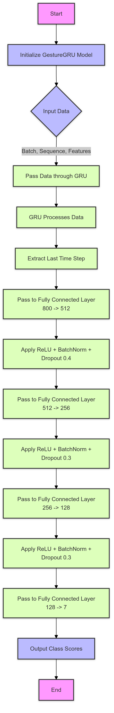
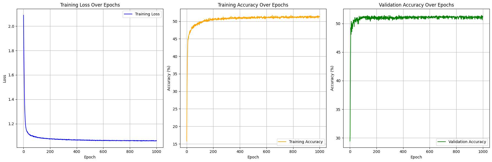

# Capstone
Here is a **README.md** file tailored for your GitHub repository:

---

# Wi-Fi Based Gesture Recognition Using RSSI Data

This repository contains the implementation of a **Wi-Fi RSSI-based gesture recognition system** using machine learning models like **CNN** and **GRU**. The project leverages Wi-Fi signals to identify gestures while preserving user privacy, offering a cost-effective solution for human-computer interaction (HCI) applications.

## Table of Contents

- [Overview](#overview)
- [Features](#features)
- [Dataset](#dataset)
- [Model Architectures](#model-architectures)
- [Results](#results)
- [Requirements](#requirements)
- [Future Work](#future-work)
- [Contributors](#contributors)

---

## Overview

This project aims to recognize hand gestures such as **swipes**, **waves**, and **claps** using fluctuations in **Wi-Fi RSSI (Received Signal Strength Indicator)** data. The system does not require specialized sensors or cameras, ensuring **non-intrusive** and **privacy-preserving** gesture detection.

### Key Highlights:
- **RSSI Data Collection**: Leveraging standard Wi-Fi hardware.
- **CNN Model**: Convolutional Neural Network for gesture classification.
- **GRU Model**: Gated Recurrent Unit for improved temporal analysis.
- **Comparison**: Evaluating CNN vs. GRU performance.

---

## Features

1. **Wi-Fi-Based Gesture Recognition**: Cost-effective, privacy-focused solution.
2. **Machine Learning Models**:
   - CNN for spatial analysis.
   - GRU for temporal sequence learning.
3. **Accuracy**:
   - CNN Validation Accuracy: **43.42%**
   - GRU Validation Accuracy: **51.15%**
4. **Performance Plots**: Training loss and validation accuracy graphs.
5. **Future Enhancements**: Web application and edge device deployment.

---

## Dataset

The dataset includes:
- **RSSI values** collected using a MacBook's Wi-Fi interface.
- **Gestures**: Swipe, Wave, Clap, Push.
- Environmental factors:
  - Distance (1-5 meters),
  - Number of connected devices,
  - Obstructions (walls).

---

## Model Architectures

### 1. GestureCNN
- **Type**: Convolutional Neural Network (CNN).
- **Performance**: Suitable for spatial analysis but lacks sequential awareness.
- **Accuracy**: **43.42%** (Validation).

### 2. GestureGRU
- **Type**: Gated Recurrent Unit (GRU).
- **Performance**: Effective for temporal dependencies and long-term sequences.
- **Accuracy**: **51.15%** (Validation).

---

## Results

| **Models**       | **Training Accuracy (%)** | **Validation Accuracy (%)** |
|------------------|--------------------------|----------------------------|
| Gesture CNN      | 43.42                   | 43.42                     |
| Gesture GRU      | 51.26                   | 51.15                     |

---

## Requirements

- Python >= 3.8
- PyTorch >= 1.10
- NumPy
- Matplotlib
- Pandas

### 2. Results and Plots

## Future Work

- **Web Application**: Develop a real-time gesture recognition app.
- **Edge Device Deployment**: Optimize the model for real-time performance on edge devices.
- **Hybrid Models**: Combine CNN and GRU for improved accuracy.
- **Data Augmentation**: Introduce time-based variations for robustness.

---

## Contributors

- **Shashidhar Reddy Ainala**
- **Onkar Kunte**
- **Venu Khare**
- **Jainam Bhansali**

